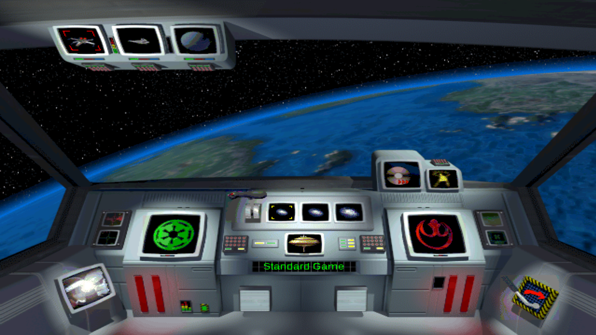
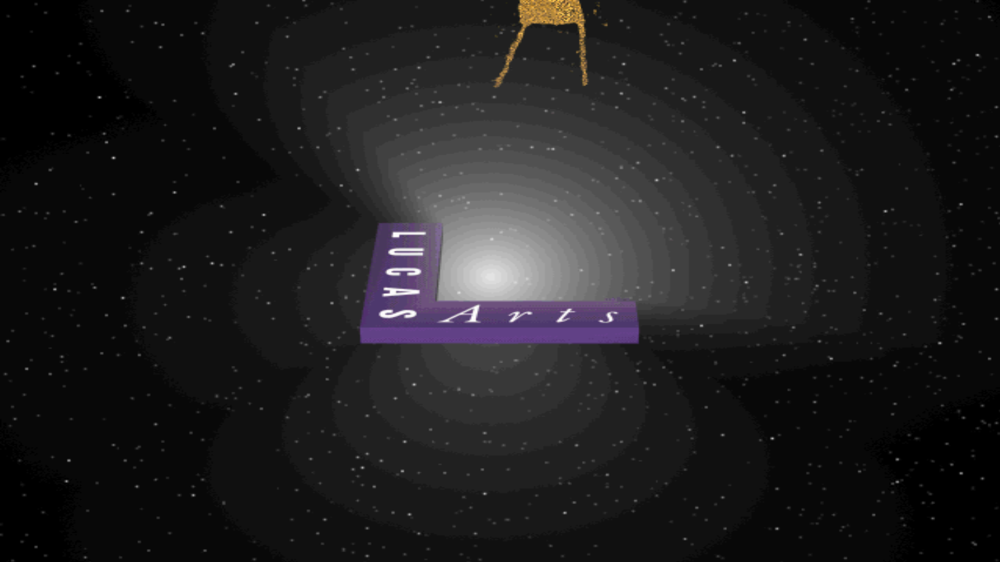
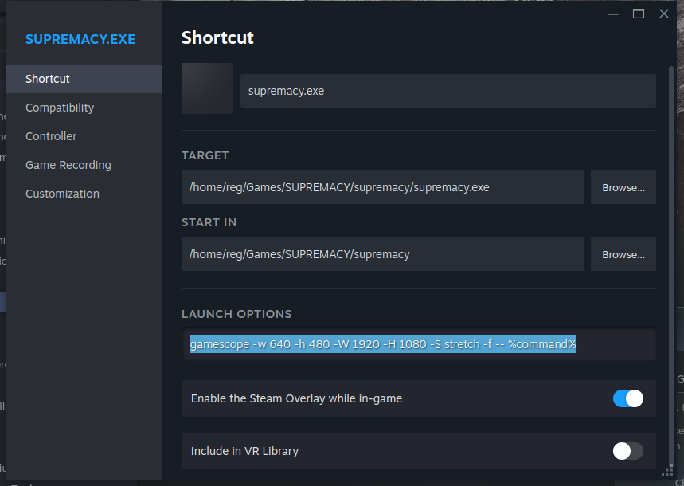

# Star Wars Supremacy / Rebellion: Linux Fullscreen Scaling History

This document serves as a local history of the configuration changes and structural workarounds applied to resolve resolution scaling, rendering instabilities, and palette bugs for *Star Wars Supremacy* running on Ubuntu via Steam Proton (verified using **Proton 8.0**).



*For visual inspiration of a fully modded and stabilized game, watch the [Star Wars Rebellion 25th Anniversary Mod Overview on YouTube](https://www.youtube.com/watch?v=2QI-di2l4S8).*

Official Project Repository: https://github.com/revhawk/star_wars_supremacy_rebellion

---

## Technical Context & Core Roadmap

### 1. The Initial Roadblocks
* **The Resolution Clashes:** The native 1998 game engine is hardcoded to output a fixed $640\times480$ layout frame utilizing legacy Direct3D Retained Mode architecture.
* **The dgVoodoo Silent Fallback:** Modern iterations of legacy graphics wrappers (such as dgVoodoo v2.86.5) fail to cleanly map onto Proton's modern display routines on Linux. Even when library files are carefully case-matched to Linux file system sensitivity rules (`ddraw.dll` and `d3dimm.dll`), the wrapper silently fails to execute, causing the engine to retreat to a tiny, unscaled viewport with no visible watermark.
* **The Palette Bug (Black Boxes):** Attempting to bypass custom wrappers and force standard Proton window expansion triggers an 8-bit paletted texture translation failure, rendering cockpit monitor screens, UI panels, and interactive switches as solid black squares.
* **Focus Instability:** Running the engine uncontained forces Ubuntu's GNOME window manager to automatically collapse and minimize the process into an unrecoverable background state the moment the window loses focus.

### 2. The Final Resolution: Valve's Gamescope
The definitive solution bypasses internal DirectDraw interceptors completely. By utilizing **Gamescope** (Valve's specialized micro-display compositor), the system isolates the $640\times480$ engine within a sandboxed virtual frame—preserving the original color palette layout perfectly—and handles the upscale natively at the hardware compositor level.

---

## Step-by-Step Implementation Log

### Step 1: Disabling Graphics Wrapper Overrides
To prevent geometry detection conflicts, local dgVoodoo libraries must be systematically renamed or moved out of the active loading chain so Proton ignores them:
```bash
cd ~/Games/SUPREMACY/supremacy/
mv ddraw.dll ddraw.dll.disabled 2>/dev/null
mv d3dimm.dll d3dimm.dll.disabled 2>/dev/null
```



### Step 2: Configuring Steam Launch Options for Gamescope
To run the game sandboxed inside Gamescope, configure the launch options in Steam:
1. Right-click the game in your Steam Library and select **Properties**.
2. Under the **General** tab, locate the **Launch Options** text field.
3. Add the following command line:
   ```bash
   gamescope -w 640 -h 480 -W 1920 -H 1080 -S stretch -f -- %command%
   ```
   *(Note: Feel free to adjust the output width `-W` and height `-H` to match your screen resolution, e.g. `-W 2560 -H 1440` for 1440p monitors, or remove `-f` if you prefer windowed mode).*

   *(Keyboard Shortcut: Gamescope captures mouse movement and traps the cursor inside the upscaled frame. For users running dual monitors or switching tasks, press `Super + F` to toggle Gamescope between borderless fullscreen and windowed modes natively without killing the execution thread).*



---

## Troubleshooting & Post-Installation Tweaks

### 1. Save System Failure
If the game silently fails to save, it is because of case-sensitivity issues and the missing legacy directory expected by the 1998 engine. 

To resolve this, manually create the `SaveGame` folder inside the installation path and set appropriate permissions:
```bash
cd ~/Games/SUPREMACY/supremacy/
mkdir -p SaveGame
chmod -R 755 ~/Games/SUPREMACY/supremacy/
```

### 2. Tactical 3D Battle Crash (Direct3D Retained Mode)
While the 2D strategic map runs smoothly, loading a 3D tactical battle will instantly crash the game. This is because the 3D map relies on **Direct3D Retained Mode** (`d3drm.dll`), which is absent in modern Proton environments.

You have two solutions:
* **The "Grand Admiral" Approach:** Auto-resolve all tactical battles. This bypasses the 3D engine completely and keeps the focus purely on the grand strategy mechanics.
* **The Library Injection Fix:** Drop a native copy of `d3drm.dll` (which can be found under the DirectX setup folder on the game installation media: `/directx/d3drm.dll`) into the active game directory (`~/Games/SUPREMACY/supremacy/`). Proton will load the DLL and enable 3D battles to render. If it doesn't load automatically, prepend `WINEDLLOVERRIDES="d3drm=n,b"` to your launch options:
  ```bash
  WINEDLLOVERRIDES="d3drm=n,b" gamescope -w 640 -h 480 -W 1920 -H 1080 -S stretch -f -- %command%
  ```

---

## Resources & Acknowledgments
* [StarWarsRebellionEditor.NET](https://github.com/MetasharpNet/StarWarsRebellionEditor.NET/tree/master) - A fantastic resource that provided some excellent design ideas and technical reference points.
* [Valve Proton Issue Tracker: Thread #3915](https://github.com/ValveSoftware/Proton/issues/3915) - The official compatibility issue tracker documenting Direct3D Retained Mode limitations, 8-bit palette bugs, and 3D tactical map crash discussions for this game.
* [Star Wars Rebellion 25th Anniversary Mod Overview](https://www.youtube.com/watch?v=2QI-di2l4S8) - A video overview showcasing advanced graphical customization, canonical asset swaps, and user interface modifications created using modding tools once the translation layer is stabilized.

